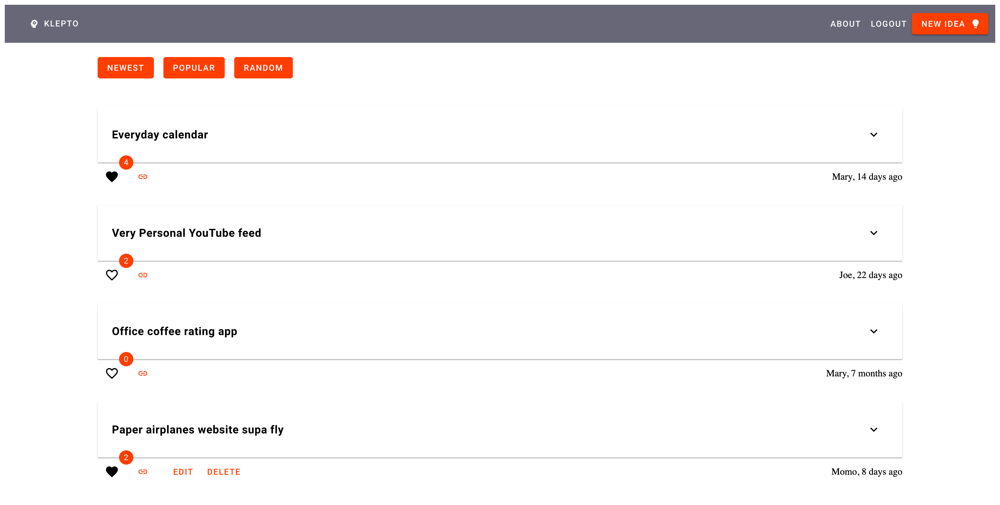

# Klepto

Simple website for sharing project ideas for others to steal, whether for education, fun, or profit.

This MVP is based on [Svelte](https://svelte.dev), [SvelteKit](https://kit.svelte.dev),
[MongoDB](https://www.mongodb.com), and [Svelte Material UI](https://sveltematerialui.com).



## Contributing

Since this project was made as a quick and dirty prototype, there's plenty more work to do!

If you'd like to contribute, please check out [issues on GitHub](https://github.com/wunderdogsw/klepto/issues). If you 
find bugs or have ideas for enhancements, go ahead and open new issues. 

To get coding, make sure to work on a separate branch and open pull requests to get your contribution reviewed and merged.
## Setup

1. Install packages with `npm install` (or `pnpm install` or `yarn`)
2. Setup MongoDB or [sign up for MongoDB Atlas](https://www.mongodb.com/cloud/atlas/register)
3. Create a new MongoDB database and initialize two collections: `users` and `ideas`
4. Copy `.env.example` to `.env` and fill in all the relevant env variables

## Developing

Start a development server:

```bash
npm run dev

# or start the server and open the app in a new browser tab
npm run dev -- --open
```

## Building

To create a production version of your app:

```bash
npm run build
```

You can preview the production build with `npm run preview`.

> To deploy your app, you may need to install an [adapter](https://kit.svelte.dev/docs/adapters) for your target environment.
